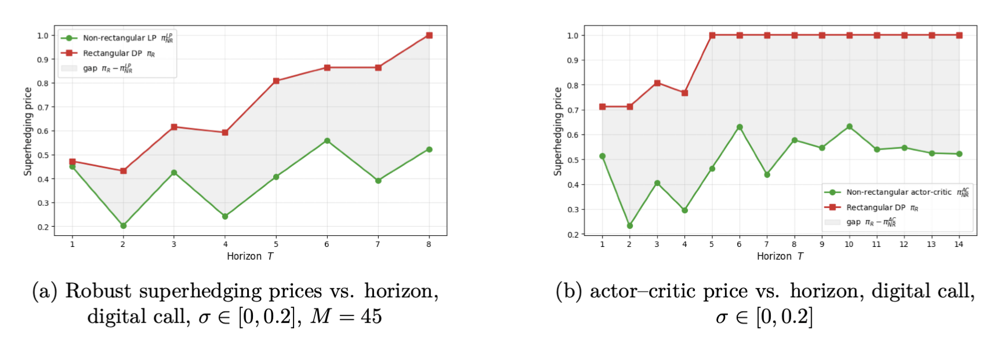
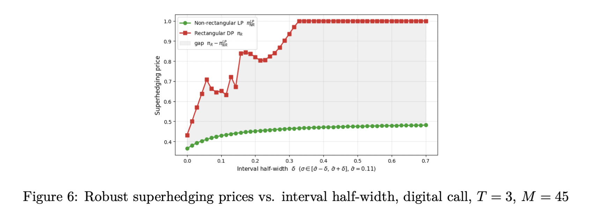
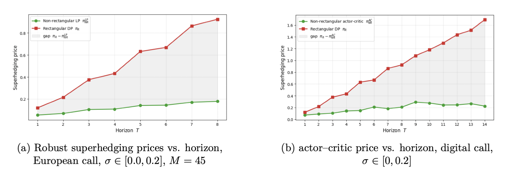

# On Rectangularity in Distributional Robust Asset Pricing

In this thesis, we reformulate robust superhedging as a robust Markov decision process (MDP) and compare rectangular and non-rectangular prices for a parametric volatility uncertainty model in order to quantify the gap. We assume we don't know the true distribution of the returns of the underlying and thus want to price against a whole set of possible models and charge enough to hedge under the worst one.

The non-dominated framework of Bouchard and Nutz (2015), which we adopt here, allows for ambiguity sets consisting of mutually singular probability measures and is therefore well suited to ambiguity sets defined through statistical distances such as Wasserstein balls.

However, one of the largest challenges in Wasserstein distributionally robust optimization is that computational tractability is typically recovered by imposing rectangularity on the ambiguity set as in Epstein and Schneider (2003) and the robust Markov decision processes (MDP) literature of Iyengar (2005) and Nilim and El Ghaoui (2005). Rectangularity allows robust MDP problems to be solved through dynamic programming, and Wiesemann et al. (2013) showed that without it the problem can be strongly NP-hard.

The numerical results show that the rectangularity gap can be large when uncertainty is coupled across time, meaning that rectangular approximations may substantially overstate the capital required for robust hedging. Overall, we show that rectangularity is not a harmless tractability assumption, but a modeling choice with direct pricing consequences.

We make two main contributions. First, we introduce and analyze the rectangularity gap, defined as the difference between the robust superhedging price under the rectangularized ambiguity set and the price under the original non-rectangular ambiguity set. We show that this gap is nonnegative and relate it to the loss of global consistency constraints across time. We also derive theoretical examples and structural results that identify when the gap can vanish and when it can become economically significant.

## Numerical results

Both experiments use the volatility-interval ambiguity set σ ∈ [0, 0.2]. The rectangular price π_R (dynamic programming) is compared against the non-rectangular price computed by the discretized linear program (π_NR, exact for T ≤ 8) and by the actor–critic algorithm (extending the comparison to T = 14).

**Digital call `1{S_T ≥ K}`.** The payoff is bounded, so the rectangular price saturates at 1 and the gap stabilizes.






**European call `max(S_T − K, 0)`.** The payoff is unbounded and 1-Lipschitz, so both prices grow with the horizon and the gap widens without saturating.




## Repository

```
sigma_interval_digital_call.ipynb    # digital call experiments 
sigma_interval_european_call.ipynb   # European call experiments 
figures/                             # result plots
```

Each notebook builds the path tree, solves the LP benchmark and rectangular DP exactly, runs the actor–critic loop, and reproduces the convergence and horizon/radius sweep figures.

```bash
pip install numpy scipy cvxpy matplotlib jupyter
jupyter lab
```


## References

- Bouchard and Nutz (2015), *Arbitrage and duality in nondominated discrete-time models.*
- Epstein and Schneider (2003), *Recursive multiple-priors.*
- Iyengar (2005), *Robust dynamic programming.*
- Nilim and El Ghaoui (2005), *Robust control of Markov decision processes with uncertain transition matrices.*
- Wiesemann, Kuhn and Rustem (2013), *Robust Markov decision processes.*
